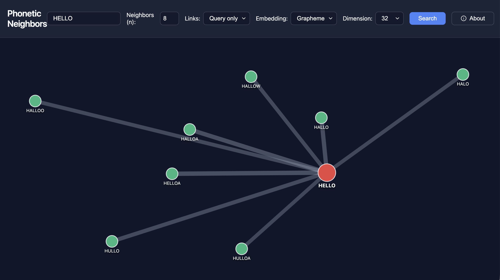

# ANE Plot
A web application for exploring the phonetic relationships between words using Apple's [Acoustic Neighbor Embeddings](https://github.com/apple/ml-acn-embed). It takes in a word and outputs its $n$ nearest phonetic neighbors as an interactive 2D edge-weighted graph

## Key Components:

- **Acoustic Embeddings**: Utilizes Woojay Jeon's (@Apple) [Acoustic Neighbor Embeddings (ACN)](https://github.com/apple/ml-acn-embed) to map words into a high-dimensional space where similar-sounding words are closer together. There is a setting at the top of the page for the dimensionality of the global embedding.
- **Radial Layout**: The query word sits in the centre and each neighbor sits at its true embedding distance from it, so the length of each query link is to scale. Dashed rings mark round distances (e.g. 0.2, 0.4, 0.6) so you can read distances off the plot. The direction of each neighbor comes from a [PCA](https://en.wikipedia.org/wiki/Principal_component_analysis) projection, which keeps similar-sounding neighbors on the same side. Neighbors only slide along their ring to avoid overlapping, so their distance never changes. Links between two neighbors (the "Full graph" option) are only approximate, since no 2D drawing can keep every pairwise distance.
- **Interactive Graph**: Renders query words and their nearest acoustic neighbors using D3.js. Hover over nodes to inspect individual similarity distances.
- **Pronunciation**: Hovering over a word reads it aloud with the browser's built-in text-to-speech. Pick the voice from the "Voice" menu; the page picks a good English voice by default and remembers your choice. Browsers only play sound after you click on the page, so until then the speaker button asks for a click. After that it mutes and unmutes pronunciation.



There is a version running at [https://quickin.stanford.edu/ane](https://quicksin.stanford.edu/ane)
## Setup

### 1. Clone the repository
Because this project depends on `ml-acn-embed` as a Git submodule, you need to make sure the submodule is initialized when you clone the project:

```bash
git clone --recursive git@github.com:kentslaney/acn-plot.git
cd acn-plot
```

*If you already cloned the repository without the `--recursive` flag, you can fetch the submodule by running:*
```bash
git submodule update --init --recursive
```

### 2. Set up the virtual environment
Create a virtual environment and install the required dependencies (including the `ml-acn-embed` package in editable mode):

```bash
python3 -m venv venv
source venv/bin/activate
pip install flask scikit-learn numpy torch torchaudio
pip install -e ml-acn-embed
```

### 3. Download the models and data
Download the pretrained acoustic embedding models and the pruned wakeword dictionary:

```bash
curl -s https://ml-site.cdn-apple.com/models/ml-acn-embed/model.tgz | tar xz
curl -s https://ml-site.cdn-apple.com/models/ml-acn-embed/wakeword.tgz | tar xz
curl -s https://raw.githubusercontent.com/Alexir/CMUdict/master/cmudict-0.7b -o cmudict-0.7b
```

### 4. Run the webserver
Start the Flask application (it runs on port 5001 to avoid conflicts with macOS AirPlay Receiver):

```bash
python app.py
```

The server uses HTTPS by default, which needs the `cryptography` package. For local use, run it over plain HTTP instead:

```bash
python app.py --nossl --host=127.0.0.1
```

Open your browser and navigate to [http://127.0.0.1:5001](http://127.0.0.1:5001) to interact with the graph!
